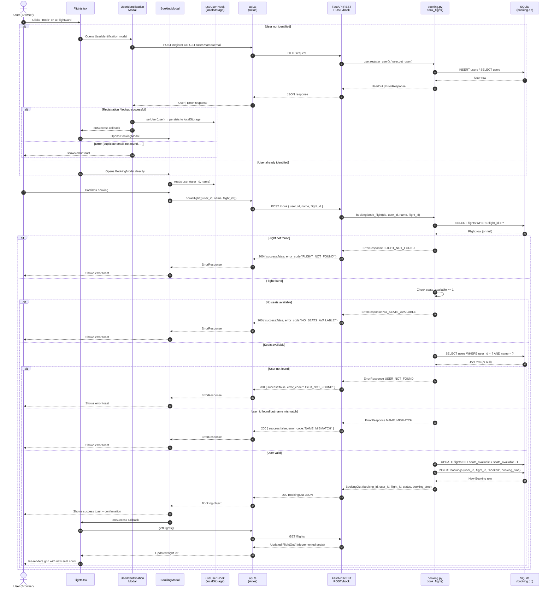

# `book_flight` — End-to-End Sequence

Full flow from the user clicking **Book** in the browser through to the confirmation returned by the backend, including all validation branches.

## Validation order in `book_flight()`

The service layer enforces checks in this exact sequence — an early failure short-circuits without touching the database further:

1. **Flight exists** — `FLIGHT_NOT_FOUND` if no matching `flight_id`
2. **Seats available** — `NO_SEATS_AVAILABLE` if `seats_available < 1`
3. **User exists + name matches** — `USER_NOT_FOUND` or `NAME_MISMATCH`
4. **Write** — decrement `seats_available`, insert `Booking` row, commit

## Key implementation notes

- The REST endpoint (`POST /book`) uses `Depends(get_db)` and returns `BookingOut | ErrorResponse` — it never raises an HTTP exception.
- The MCP tool (`@mcp.tool() book_flight`) calls `SessionLocal()` directly and converts an `ErrorResponse` into a raised `Exception` for the AI agent.
- `booking_time` is stored as an ISO 8601 string (`datetime.utcnow().isoformat()`), not a native `DateTime` column.
- After a successful booking the frontend reloads the full flight list so the seat count is always fresh.
